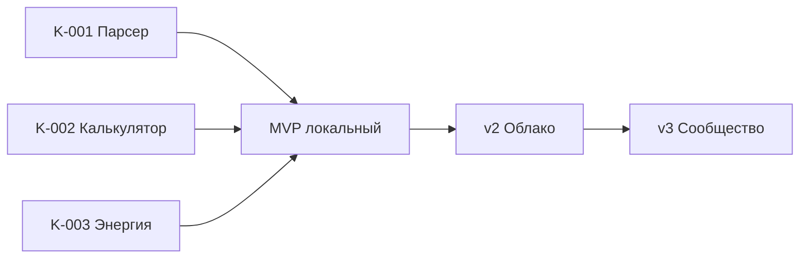

# Дорожная карта

## Фазы

```
MVP (локальный)          →  v1 (данные + расчёт)  →  v2 (облако)  →  v3 (сообщество)
     .tfgp import/export       парсер TFG              аккаунты         рейтинги, тренды
     редактор холста           двусторонний calc       хранилище        главная-витрина
     версии модпака            энергия (по мере)        режимы доступа
     RU + EN
```

---

## MVP — локальный планировщик

**Цель:** пользователь собирает схему, считает потоки, сохраняет `.tfgp` на диск.

| Фича | Kanban | Статус |
|------|--------|--------|
| Парсер Modpack-Modern | K-001 | planned |
| Меню версий + pack data | K-001 | planned |
| Редактор мнемосхем | — | planned |
| Двусторонний расчёт продуктов | K-002 | planned |
| Масштабирование цепочки / группы | — | planned |
| Import / export `.tfgp` | — | planned |
| i18n RU + EN | K-004 | planned |

**Вне MVP:** облако, аккаунты, публичная витрина, рейтинги.

---

## v2 — облако и хранилище пользователя

> Зафиксировано заказчиком как **планы**, не реализуем до стабильного MVP.

### Аккаунты и хранилище

- Регистрация / вход пользователя.
- **Личное хранилище схем** — список, поиск, дубликаты, удаление.
- Схема в облаке = тот же граф, что в `.tfgp`, плюс метаданные для каталога.

### Режимы доступа к схеме

| Режим | Описание |
|-------|----------|
| **Приватный** | Только владелец |
| **По ссылке** | Любой с URL, без индексации в каталоге |
| **Публичный** | Виден в каталоге и на главной |

### Публикация

- Пользователь выбирает режим при сохранении / публикации.
- Публичные схемы — с превью (thumbnail холста), названием, автором, версией модпака, тегами.

**Пока (MVP):** только файловый обмен `.tfgp`. Облачные URL — не в скоупе.

---

## v3 — главная страница и сообщество

### Витрина на главной

- **Карточки публичных схем** — сетка с превью, названием, автором, рейтингом.
- **Рейтинг** — голоса пользователей (детали механики TBD: upvote, звёзды, лайки).
- Блок **«Новые схемы»** — недавно опубликованные публичные схемы.
- Блок **«В тренде»** — популярные за период (алгоритм TBD: просмотры + рейтинг + свежесть).

### Навигация (целевая)

```
Главная (витрина)  ·  Мои схемы  ·  Редактор  ·  Версии  ·  Профиль
```

---

## Зависимости между фазами



---

## История решений

| Дата | Решение |
|------|---------|
| 2026-06-17 | Облако и публичные ссылки — только в планах; MVP = `.tfgp` |
| 2026-06-17 | Главная с рейтингом, «Новые», «В тренде» — фаза v3 |
| 2026-06-17 | Заглушки в коде запрещены; недоделки → [kanban.md](kanban.md) |
